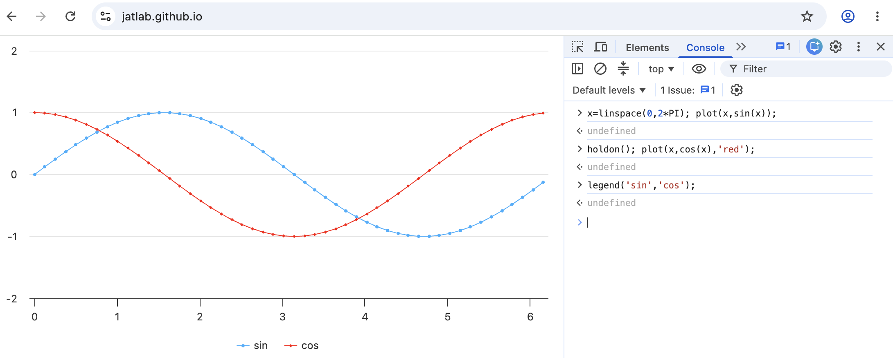

# JATLAB
JATLAB: Use your browser as Scientific Calculator [jatlab.github.io](http://jatlab.github.io/)

## Motivation
Lots of people with Engineering background like myself have used MATLAB since their school years, not just for official projects, but also frequently as a quick calculator. 

Unfortunately, with each new version of MATLAB the software has become more and more bloated with rarely used features, resulting in longer and longer load times and heavy memory/CPU usage. Also, the MATLAB license has become more expensive and restrictive, and as a result it is not as widely available as before. 

Finding myself having have to use much lessor alternatives like the calculator app, an idea came to me.

## Features
With JATLAB, from modern Desktop web browsers (Chrome,Edge,etc) load [jatlab.github.io](http://jatlab.github.io/) then press F12 key to open Developer Console to instantly do over ~95% of things you used to do in MATLAB: 

- All Javascript math functions available in Math.* can be used *without* typing `Math.` in front, such as:
	- `sin`,`cos`,`tan`,`exp`,`log10`,`log`,`sqrt`,...
	- All these functions are extended to *accept 1D array as input* and returns array
	- Many MATLAB statistic functions such as `rms`,`mean`,`abs`, `sum`. 
- Most commonly used MATLAB features are availble:
	- Plotting: `plot`,`figure`,`close`,`holdon`,`holdoff`,`legend`,`xlabel`,`ylabel`,`title`,`semilogx`,`semilogy`,`loglog`
	- Some 3D Plotting: `contour`,`heatmap`
	- Saving and loading CSV files: `csvread`,`csvwrite`
	- FFT: `fft`,`ifft`,`hanning`
	- Complex numbers: `abs`,`angle`,`real`,`imag`. Complex numbers are in the 2-element array *[real_part, imag_part]*. 
	- `linspace`,`logspace`,`ode23`

MATLAB is vast, but I hope over time people will contribute their expertise to this project to expand these features. 

## Examples

### Basic Plotting
[](http://jatlab.github.io/)
```js
x=linspace(0,2*PI); plot(x,sin(x));
holdon(); plot(x,cos(x),'red');
legend('sin','cos');
```

### 3D Plotting of Time Marched Burger's Equation dy/dt = -y*dy/dx
```js
function dwdt(t,y){
let n=y.length; let dx=1/n; 
return y.map( (yu,i)=>-yu*(y[(i+1)%n]-y[i])/2/dx );
}

let tspan = linspace(0,0.32,100); 
let y0=sin(linspace(0,2*PI,100));
let y=ode23(dwdt, tspan, y0);
heatmap(y);
xlabel('x'); ylabel('Time');
```

